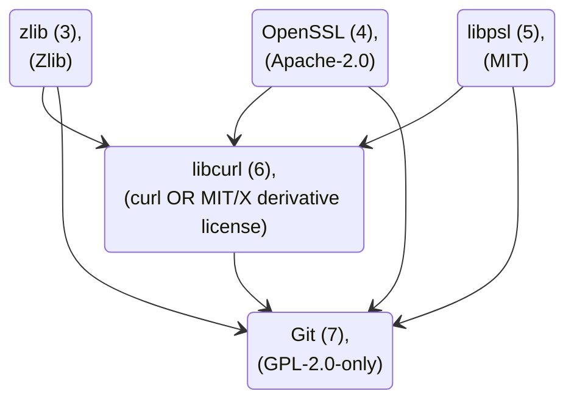

# License

This repository has the [MIT](https://spdx.org/licenses/MIT.html) license ([LICENSE](LICENSE) file), but it uses many other projects, each of which has its own license that must be observed, see [THIRD_PARTY_LICENSES](THIRD_PARTY_LICENSES).

<!-- The `LICENSE` and `THIRD_PARTY_LICENSES` files are copied to the repositories published by NuGet. -->

More about licensing: [licensing-a-repository](https://docs.github.com/en/repositories/managing-your-repositorys-settings-and-features/customizing-your-repository/licensing-a-repository) and [SPDX-licenses](https://spdx.org/licenses/).

## License Portable Git for Linux 

- Build stage (3): Zlib ([zlib](https://zlib.net/zlib_license.html)), [SPDX](https://spdx.org/licenses/Zlib.html)
- Build stage (4): Apache-2.0 ([OpenSSL](https://github.com/openssl/openssl?tab=Apache-2.0-1-ov-file#readme)), [SPDX](https://spdx.org/licenses/Apache-2.0.html)
- Build stage (5): MIT ([libpsl](https://github.com/rockdaboot/libpsl/blob/master/LICENSE)), [SPDX](https://spdx.org/licenses/MIT.html)
- Build stage (6): MIT/X derivative license ([libcurl](https://curl.se/docs/faq.html#License-Issues)), [SPDX](https://spdx.org/licenses/curl.html)
- Build stage (7): GPL-2.0-only ([Git](https://git-scm.com/about#free-and-open-source)), [SPDX](https://spdx.org/licenses/GPL-2.0-only.html)

## License Portable Windows

- Download: GPL-2.0-only ([Git for Windows](https://github.com/git-for-windows/git?tab=License-1-ov-file#readme)), [SPDX](https://spdx.org/licenses/GPL-2.0-only.html)
